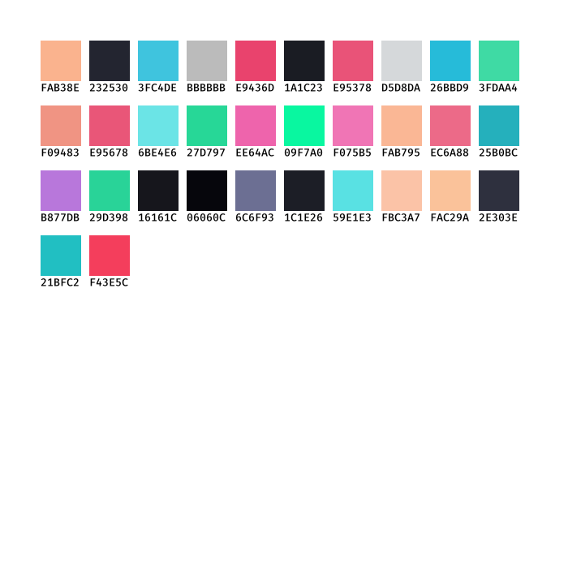

<p align="center">
  
</p>

# Themer:

A Color Palette Generator that regexes colours out of text files.

Themer is a Rust command-line tool designed to extract hexadecimal color codes from input files.

## Features:

- Extract Color Codes: Scans any text file for hexadecimal color codes.
- Generate Image Palette: Creates an image file with a visual representation of the colors.
- Flexible Input: Accepts any file containing hex codes scattered within text.

## Installation

To install Themer, you need Rust's cargo tool installed on your machine. Follow these steps:

```
Clone the repository:
```

```bash

git clone https://github.com/yourusername/themer.git
cd themer

```

## Build the project:

```bash

cargo build --release

```

## Usage:

To use Themer, provide the path to a text file as an argument:

```bash

themer "/home/jer/.vscode/extensions/alexandernanberg.horizon-theme-vscode-1.0.1/themes/horizon.json"

```

then checkout the `horizon.png`

# License

Themer is released under the MIT License. See the LICENSE file for more details.
